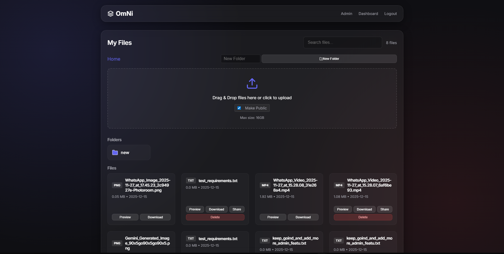
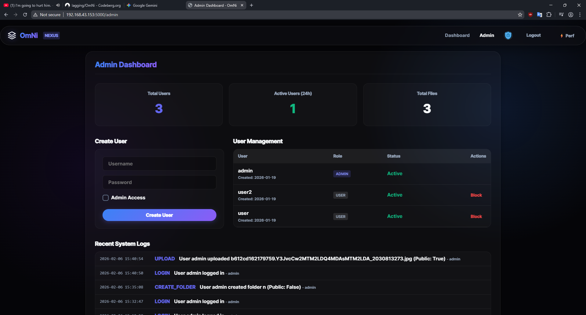

🎉 OmNi is now in v1.0 (Official Release)! Stable and optimized.

# OmNi File Sharer 🚀

OmNi is a self-hosted, local network file-sharing application designed for speed, privacy, and simplicity. Built with Python (Flask) and a modern glassmorphism UI.





## ✨ Features

- **📂 Smart Dashboard**: Grid view with live previews for images, videos, audio, and PDFs.
- **🔒 Security First**:
  - **E2EE**: Client-side encryption before upload (you hold the password).
  - **Privacy Control**: Mark files/folders as Public or Private.
  - **User Profiles**: Custom bios, display names, and avatars.
- **🌏 Global Reach**: Full Unicode support for multi-language filenames (Korean, Chinese, etc.).
- **📱 Mobile-Ready**:
  - **PWA Support**: Install as a native-like app.
  - **QR Connection**: Scan to connect instantly—no manual IP entry.
- **🛡️ Admin Suite**: Full visibility, activity logs, and user management.
- **💎 Editions**:
  - **Core**: Lightweight, single-user focus (Personal).
  - **Nexus** (Default): Full-featured, multi-user, social sharing (Team/Office).

## 🛠️ Quick Start

### 1. Installation
```bash
git clone https://codeberg.org/lagging/omni.git && cd omni
python -m venv venv && source venv/bin/activate  # Windows: venv\Scripts\activate
pip install -r requirements.txt
```

### 2. Run
```bash
python run.py
```
Access at `http://localhost:5000` or your local IP (e.g., `192.168.1.5:5000`).

### 3. Switch Editions (Optional)
OmNi defaults to **Nexus** (Multi-user). To run in **Core** (Personal) mode:
#### Linux/Mac:
```bash
export OMNI_EDITION=CORE
python run.py
```
#### Windows (PowerShell):
```powershell
$env:OMNI_EDITION="CORE"
python run.py
```

> [!IMPORTANT]
> **First Step**: Change default admin credentials (`admin`/`admin`) in `config.py`.

## 🔐 Security Checklist

OmNi now features an **Automatic Setup Wizard** to help you secure your instance on first run.

Before exposing OmNi beyond your local machine, **you must**:

1. **Complete the Setup Wizard** — This will guide you through setting a secure `SECRET_KEY` and admin credentials.
2. **Use HTTPS** — set up a reverse proxy (nginx/Caddy) with SSL for remote access.
3. **Firewall rules** — only expose the port to trusted networks (or use a Cloudflare Tunnel).

> [!CAUTION]
> OmNi is designed for **trusted local networks**. Without the above steps, do not expose it to the public internet. 
> 
> **Highly Recommended**: Read our detailed [Remote Access Guide](REMOTE_ACCESS.md) for secure setup instructions using Cloudflare Tunnels (no port forwarding required).

## 📁 Custom Upload Folder

By default, uploaded files are stored in `./uploads/`. To use a different location, edit `config.py`:

```python
# In config.py, change UPLOAD_FOLDER:
UPLOAD_FOLDER = 'D:/MyFiles/OmNi_Uploads'  # Windows example
# UPLOAD_FOLDER = '/mnt/storage/omni'      # Linux example
```

Or set it via environment variable:
```bash
export UPLOAD_FOLDER=/path/to/your/folder
```

## 📦 Deployment & Extras

- **🐳 Docker**: `docker compose up -d --build`
- **🪟 Windows (.exe)**: [Download OmNi.exe](https://codeberg.org/lagging/OmNi/releases/download/v1.0.0-/OmNi.exe) or build yourself with `.\build_exe.ps1`
- **🌍 Remote Access**: Check the [Remote Access Guide](https://codeberg.org/lagging/OmNi/src/branch/main/REMOTE_ACCESS.md)
- **🗺️ Roadmap**: See what's coming in the [Roadmap](https://codeberg.org/lagging/OmNi/src/branch/main/ROADMAP.md)

## 🤝 Contributing & Support

OmNi is built with standard Python, HTML, and CSS—designed to be easy for anyone to modify. 

**License**: MIT. Feel free to host and hack!

---

*"There is no spoon."* 🥄
